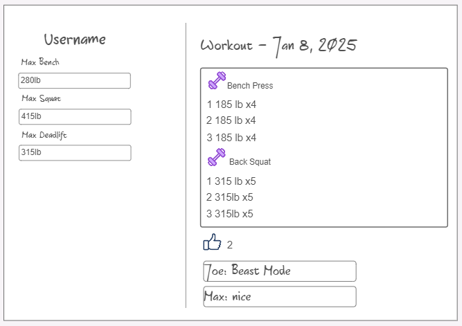
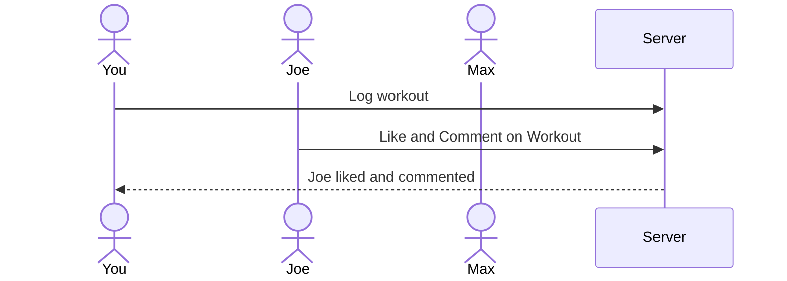

# DEFCOR Strength

[My Notes](notes.md)

A fitness tracking app that allows users to view eachother's workouts, as well as like and comment on them.

## 🚀 Specification Deliverable

For this deliverable I did the following. I checked the box `[x]` and added a description for things I completed.

- [x] Proper use of Markdown
- [x] A concise and compelling elevator pitch
- [x] Description of key features
- [x] Description of how you will use each technology
- [x] One or more rough sketches of your application. Images must be embedded in this file using Markdown image references.

### Elevator pitch

Are you tired of tracking your workouts only to lose your notes? Have you wanted to brag to your friends and family about your rediculously impressive bench press? DEFCOR Strength allows you to effortlessly track your workout of the day and your 1 rep maxes for your favorite lifts. Others can log in and see your most recent workout where they can like and comment on your routine in realtime for all users to see.

### Design

Here is a sequence diagram that shows how users will log, like, and comment on workouts.

### Key features

- Secure login over HTTPS
- Log a workout using exercises from Wger API
- Ability to like and comment on a workout post form another user
- Display your max record for Bench, Squat, and Deadlift
- Workout posts are persistently stored

### Technologies

I am going to use the required technologies in the following ways.

- **HTML** - Three HTML pages. One for login. One for recording workout. One for viewing feed and interacting with posts.
- **CSS** - Application styling to look good on all devices. Friendly color styling. Easy to navigate. 
- **React** - Single page application with content reacting to user actions including likes, comments, sets, and reps.
- **Service** - Backend service with endpoints for:
    - login
    - retrieving exercises from https://wger.de/en/software/api
    - logging a workout
    - retreiving workouts
    - liking and commenting on a workout
- **DB/Login** - Store users, workouts, likes, and comments. Register and login users. Store data securely. Cannot access website unless an account is created.
- **WebSocket** - When likes or comments are posted, all users receive updates.

## 🚀 AWS deliverable

For this deliverable I did the following. I checked the box `[x]` and added a description for things I completed.

- [x] **Server deployed and accessible with custom domain name** - [My server link](https://defcor-fit.com/).

## 🚀 HTML deliverable

For this deliverable I did the following. I checked the box `[x]` and added a description for things I completed.

- [x] **HTML pages** - Three HTML pages that represent the ability to login, view, comment, and like workouts, and log new workouts.
- [x] **Proper HTML element usage** - Correctly used HTML tags including BODY, NAV, MAIN, HEADER, FOOTER.
- [x] **Links** - Nav menu that links between all pages. Button on dashboard that links to the log workout page.
- [x] **Text** - Text represents a logged workout and comments from other users.
- [x] **3rd party API placeholder** - The 'Add Exercise' button represents the call to the 3rd party source of exercises.
- [x] **Images** - Included a favicon, main page image, and images next to exercises.
- [x] **Login placeholder** - Form representing a login and register function.
- [x] **DB data placeholder** - The logged workout represents data pulled from the database.
- [x] **WebSocket placeholder** - The comments and likes represent the realtime interaction of other users.

## 🚀 CSS deliverable

For this deliverable I did the following. I checked the box `[x]` and added a description for things I completed.

- [ ] **Header, footer, and main content body** - I did not complete this part of the deliverable.
- [ ] **Navigation elements** - I did not complete this part of the deliverable.
- [ ] **Responsive to window resizing** - I did not complete this part of the deliverable.
- [ ] **Application elements** - I did not complete this part of the deliverable.
- [ ] **Application text content** - I did not complete this part of the deliverable.
- [ ] **Application images** - I did not complete this part of the deliverable.

## 🚀 React part 1: Routing deliverable

For this deliverable I did the following. I checked the box `[x]` and added a description for things I completed.

- [ ] **Bundled using Vite** - I did not complete this part of the deliverable.
- [ ] **Components** - I did not complete this part of the deliverable.
- [ ] **Router** - Routing between login and voting components.

## 🚀 React part 2: Reactivity

For this deliverable I did the following. I checked the box `[x]` and added a description for things I completed.

- [ ] **All functionality implemented or mocked out** - I did not complete this part of the deliverable.
- [ ] **Hooks** - I did not complete this part of the deliverable.

## 🚀 Service deliverable

For this deliverable I did the following. I checked the box `[x]` and added a description for things I completed.

- [ ] **Node.js/Express HTTP service** - I did not complete this part of the deliverable.
- [ ] **Static middleware for frontend** - I did not complete this part of the deliverable.
- [ ] **Calls to third party endpoints** - I did not complete this part of the deliverable.
- [ ] **Backend service endpoints** - I did not complete this part of the deliverable.
- [ ] **Frontend calls service endpoints** - I did not complete this part of the deliverable.

## 🚀 DB/Login deliverable

For this deliverable I did the following. I checked the box `[x]` and added a description for things I completed.

- [ ] **User registration** - I did not complete this part of the deliverable.
- [ ] **User login and logout** - I did not complete this part of the deliverable.
- [ ] **Stores data in MongoDB** - I did not complete this part of the deliverable.
- [ ] **Stores credentials in MongoDB** - I did not complete this part of the deliverable.
- [ ] **Restricts functionality based on authentication** - I did not complete this part of the deliverable.

## 🚀 WebSocket deliverable

For this deliverable I did the following. I checked the box `[x]` and added a description for things I completed.

- [ ] **Backend listens for WebSocket connection** - I did not complete this part of the deliverable.
- [ ] **Frontend makes WebSocket connection** - I did not complete this part of the deliverable.
- [ ] **Data sent over WebSocket connection** - I did not complete this part of the deliverable.
- [ ] **WebSocket data displayed** - I did not complete this part of the deliverable.
- [ ] **Application is fully functional** - I did not complete this part of the deliverable.
